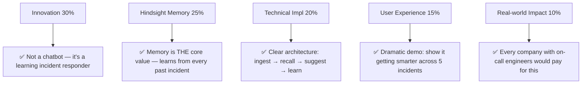
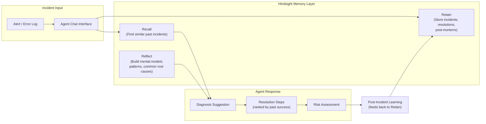

# 🏆 HackwithHyderabad 3.0 — Winning Strategy

> **Deadline:** September 29, 2026 (~2 days from now)  
> **Required Tech:** [Hindsight](https://hindsight.vectorize.io/) by Vectorize (memory system for AI agents)  
> **Promo Code:** `MEMHACK99` → $50 free credits on Hindsight Cloud

---

## Judging Criteria (What Actually Wins)

| Criteria | Weight | What Judges Want |
|---|---|---|
| **Innovation** | 30% | Fresh take on a real problem, beyond basic chatbot territory |
| **Use of Hindsight Memory** | 25% | Memory is *central*, agent clearly improves over time |
| **Technical Implementation** | 20% | Clean code, well-architected, handles edge cases |
| **User Experience** | 15% | Intuitive interaction, compelling demo story |
| **Real-world Impact** | 10% | Genuine problem, path to actual adoption |

> [!IMPORTANT]
> **55% of judging** = Innovation (30%) + Hindsight Memory (25%). Your project MUST make memory the hero of the story.

---

## 🎯 My #1 Recommendation: **Incident Response Agent for DevOps**

### Why This Problem Statement Wins

### The Pitch (60-second story)

> *"When production goes down at 3 AM, your on-call engineer doesn't have access to the tribal knowledge in senior engineers' heads. Our agent remembers every past incident — root causes, resolution steps, which runbooks worked. Incident 1: generic suggestions. Incident 5: it recognizes patterns. Incident 20: it resolves issues before humans even diagnose them."*

### Why It Beats Other Options

| Criteria | Incident Response Agent | Customer Support Agent | Deal Intelligence Agent |
|---|---|---|---|
| **Innovation** | ⭐⭐⭐⭐⭐ DevOps + memory = novel | ⭐⭐⭐ Many support bots exist | ⭐⭐⭐⭐ Good but CRM-heavy |
| **Memory Centrality** | ⭐⭐⭐⭐⭐ Useless without memory | ⭐⭐⭐⭐ Strong | ⭐⭐⭐⭐ Strong |
| **Demo-ability** | ⭐⭐⭐⭐⭐ Before/after is dramatic | ⭐⭐⭐ Hard to show progression fast | ⭐⭐⭐ Needs CRM context |
| **Build in 2 days** | ⭐⭐⭐⭐⭐ Contained scope | ⭐⭐⭐ Needs real ticket data | ⭐⭐⭐ Complex integrations |
| **Avoids student projects** | ⭐⭐⭐⭐⭐ Pure enterprise | ⭐⭐⭐⭐ Enterprise | ⭐⭐⭐⭐ Enterprise |

---

## 🛠️ Architecture & Build Plan

### System Architecture

### Tech Stack

| Layer | Technology |
|---|---|
| **Memory** | Hindsight Cloud (use promo `MEMHACK99`) |
| **LLM** | Groq (free tier) with `qwen/qwen3-32b` or `openai/gpt-oss-120b` |
| **Backend** | Python + FastAPI |
| **Frontend** | Next.js or Vite (beautiful dark-mode dashboard) |
| **Data** | Synthetic incident data (LLM-generated, realistic) |

### Core Features (Tight Scope — Nail These)

1. **Incident Intake** — Paste an error log / alert → agent parses and classifies
2. **Memory-Powered Diagnosis** — Recalls similar past incidents, suggests root cause
3. **Resolution Playbook** — Ranked resolution steps based on what worked before
4. **Post-Incident Learning** — After resolution, stores what worked → gets smarter
5. **Memory Dashboard** — Visual panel showing what the agent has learned (observations, mental models)

### The "Learning Curve" Demo (This Wins the Hackathon)

> [!TIP]
> The document specifically says: *"The most compelling demos show the agent getting noticeably better. Interaction 1: generic. Interaction 5: personalized. Interaction 20: feels like it knows you."*

**Pre-seed Hindsight with 15-20 synthetic past incidents**, then demo:

| Demo Step | What Happens | Memory State |
|---|---|---|
| **Incident 1** (cold start) | Generic suggestions, asks many questions | Empty — no prior knowledge |
| **Incident 2** (similar to #1) | Recognizes pattern: "This looks like the DB connection pool issue from last Tuesday" | 1 past incident stored |
| **Incident 5** | Immediately suggests: "Last 3 times this error code appeared, it was a Redis timeout. Try restarting the cache layer first." | Rich history, patterns forming |
| **Show Memory Panel** | Display Hindsight mental models: "Common root causes for 5xx errors in this system..." | Observations + mental models visible |

---

## 📋 2-Day Sprint Plan

### Day 1 (Sep 27-28) — Foundation

| Time Block | Task |
|---|---|
| **Evening Today** | Set up Hindsight Cloud, get API keys, study SDK docs |
| **Morning Sep 28** | Build backend: FastAPI + Hindsight integration (Retain + Recall) |
| **Afternoon Sep 28** | Generate 20 realistic synthetic incidents (use LLM) |
| **Evening Sep 28** | Build the core agent loop: ingest → recall → diagnose → learn |

### Day 2 (Sep 29) — Polish & Demo

| Time Block | Task |
|---|---|
| **Morning** | Build stunning frontend dashboard (dark mode, memory visualization) |
| **Midday** | Add the "learning curve" demo flow, test end-to-end |
| **Afternoon** | Record demo video, push clean code to GitHub |
| **Evening** | Write content deliverables (Article, Social Media post) |

---

## 📦 Submission Checklist

- [ ] GitHub Repository with clean, documented code
- [ ] Demo Video showing the agent in action
- [ ] Live Project Demo ready for judges
- [ ] Content deliverables: Article + Social Media post + Video (all team members)
- [ ] Clear explanation of how Hindsight memory is used
- [ ] Share project based on challenges from the official content guide

---

## 🔗 Key Resources

| Resource | Link |
|---|---|
| Hindsight Docs | https://hindsight.vectorize.io/ |
| Hindsight GitHub | https://github.com/vectorize-io/hindsight |
| Hindsight Cloud | https://ui.hindsight.vectorize.io |
| Groq (Free LLM) | https://groq.com/ |
| Inspiration Repo | https://github.com/vectorize-io/self-driving-agents |
| Hindsight Academy | https://learn.hindsight.vectorize.io |

> [!CAUTION]
> **Avoid student-centric projects** like AI tutors, quiz generators, or study assistants. The document explicitly warns against these. Think professional/enterprise.

---

## Why This Will Win

1. **Innovation (30%)** — DevOps incident response with memory is a fresh, non-obvious application. It's not a chatbot.
2. **Memory is the Star (25%)** — Without memory, this agent is useless. WITH memory, it becomes the senior engineer who never sleeps. The before/after contrast is dramatic.
3. **Technical (20%)** — Clean architecture: Retain incidents → Recall similar ones → Reflect on patterns → Suggest fixes. Uses all three core Hindsight primitives.
4. **UX (15%)** — A beautiful dark-mode dashboard with a memory visualization panel showing what the agent has learned.
5. **Real-world Impact (10%)** — Every company with production systems needs this. Downtime costs ~$5,600/minute for enterprises. This is immediately valuable.

> *"Now stop reading and start building. The best way to learn AI agents is to ship one."*  
> — From the hackathon problem statement
